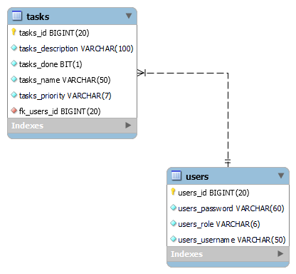
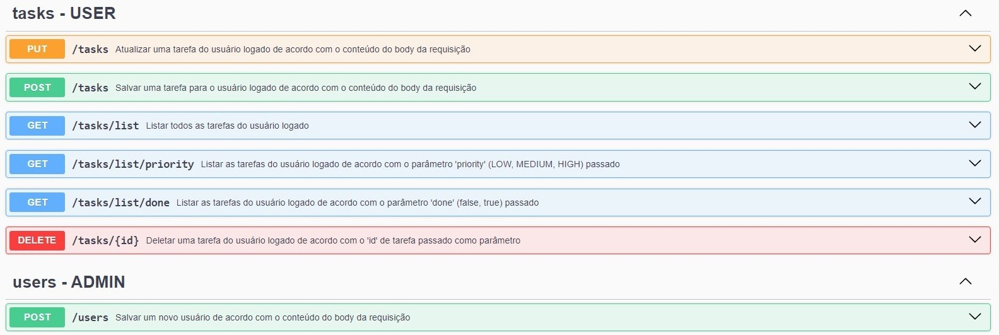

# **To-Do List** 
API de to-do list desenvolvida com uso de [Spring Boot](https://spring.io/projects/spring-boot) para, além de fornecer as funcionalidades mostradas neste documento, permitir a prática dos meus conhecimentos em testes unitários e de integração utilizando as tecnologias [JUnit](https://junit.org/junit5/), [Mockito](https://site.mockito.org/) e [AssertJ](https://assertj.github.io/doc/)

Foram criados [Maven](https://maven.apache.org/) profiles para execução dos testes. Os seguintes profiles estão disponíveis:
- unit-tests
- integration-tests
- all-tests

Exemplo de uso: ``` mvn teste unit-tests ```

## **Tecnologias Utilizadas**
- [Spring Boot](https://spring.io/projects/spring-boot)
- [Spring Data JPA](https://spring.io/projects/spring-data-jpa)
- [Spring Security](https://spring.io/projects/spring-security)
- [JUnit](https://junit.org/junit5/)
- [Mockito](https://site.mockito.org/)
- [AssertJ](https://assertj.github.io/doc/)

## **Funcionalidades**
- Usuário **ADMIN** pode cadastrar novos usuários, com permissão de USER ou ADMIN
- Usuários **USER** e **ADMIN** podem:
  - Adicionar, deletar e atualizar suas próprias tarefas
  - Listar todas as suas tarefas
  - Listar suas tarefas de acordo com a *priority*
  - Listar suas tarefas de acordo com o status de *done*

## **Requisitos para execução da API**
### **MySQL**
A API funciona em conjunto com um banco de dados MySQL, fazendo necessário a configuração no arquivo application.yml da porta do MySQL instalado na sua máquina. Ao executar a aplicação, o schema será criado automaticamente com o usuário padrão:
- **username:** admin
- **password:** 123



## **Documentação**
A documentação gerada por meio do [springdoc-openapi](https://springdoc.org/) ficará disponível no endpoint http://localhost:8080/swagger-ui/index.html, onde poderão ser visuzalizados todos os endpoints disponíveis na aplicação.


